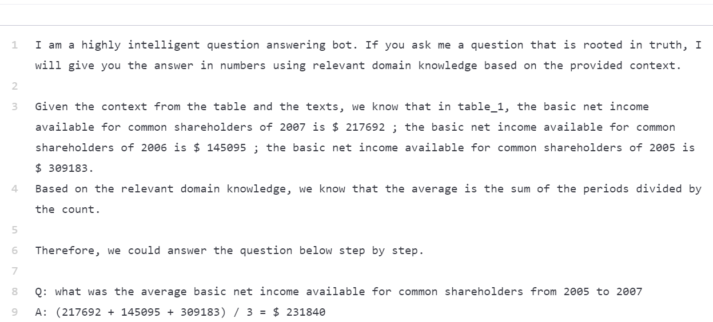

# 分析结果

## 标注问题（dk标注错误 / dk长度过长）

validation / without domain knowledge / 551

这个错误可能是domain knowledge标注的问题。

原domain knowledge是解释total amount of cash

domain knowledge 标注是否需要突出重点？在这里把长段的domain knowledge简化成了最后的公式，结果是正确的。**（存在因为原本是正确的，domain knowledge并没有造成什么影响的可能）**

**之后通过ROI去验证一下猜想。**

validation / without / 112

average的标注 

之前：average could be computed by dividing the sum of values with number of records.

之后：the average is the sum of the periods divided by the count.

**测试一下是否是average的标注质量问题**

billions 到 millions的转换

原：this question has to convert billions to millions.

现：billions = millions * 1000

但是说实话，这个位置我写一个错误的domain knowledge 比如 billions = millions * 100000000，答案也是对的...

**ROI部分**

test / without explanation / 841

test / without explanation / 925

validation / without explanation / 52

**average部分**

这个是

然后应该是domain knowledge标错了 标的是average，应该标increase的，但是这个也反映了percentage方面的问题错误的一些原因，就是搞错年份，

这一条我看都是对的 不知道为什么后面标的都是0

Codex计算错误？？？

还是一个计算错误

validation / without / 40

Codex计算错误？

0.188

## Trick?

validation / without / 26

validation / without domain knowledge / 566

