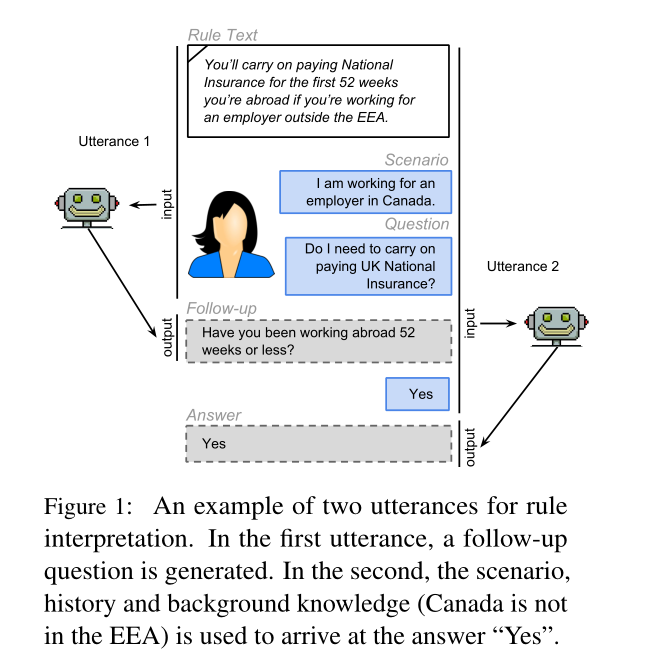
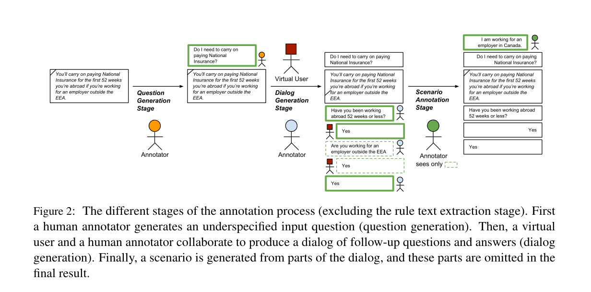
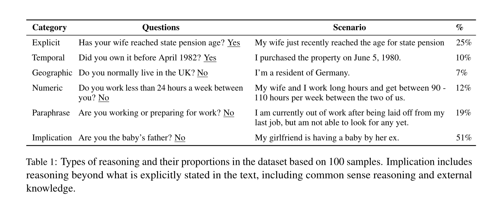

https://sharc-data.github.io/data.html 	

# Abstract

机器阅读的大部分工作都集中在问题回答问题上，在这些问题上，答案直接表达在要阅读的文本中。

然而，**许多现实世界中的问题回答问题需要阅读文本，不是因为它包含了字面的答案，而是因为它包含了与读者的背景知识一起得出答案的秘诀。**一个例子是解释法规以回答 "我可以......吗？"或 "我必须......吗？"的问题，如 "我在加拿大工作。我必须继续支付英国的国民保险吗？"在阅读了英国政府网站关于这一主题的内容之后。**这项任务既需要对规则进行解释，也需要应用背景知识。**

由于在实践中，大多数问题都是不明确的，因此，当答案不能直接从问题和文本中得出时，人类助手将经常不得不问一些澄清的问题，如 "你在国外工作了多长时间？"，这使它变得更加复杂。在本文中，我们将这一任务形式化，并开发了一个众包策略，**以收集基于现实世界的规则和群众产生的问题和场景的32k任务实例**。我们分析了这项任务的挑战，并通过评估基于规则和机器学习基线的性能来评估其难度。在不需要背景知识的情况下，我们观察到有希望的结果，而在需要背景知识的情况下则有很大的改进空间。



首先有一个Rule Text，告诉我们如果工作超过52weeks就要怎么样，然后这个Rule Text和Scenario和Question一起送到U1中，U1为了回答这个问题，提出了一个后续问题，然后这个后续问题的回答，和上面所有的东西一起，送到U2中，U2给出最终回答。


# Introduction

1. 我们介绍了对话式机器阅读的任务，并提供了评价指标。

2. 我们开发了一个注释协议来收集对话式机器阅读的注释，适合在众包平台上使用，如Amazon Mechanical Turk。

3. 我们提供了一个超过32000个机器对话式阅读语料的语料库，这些语料来自诸如补助金描述、交通法规和福利计划等领域，并包括对该语料库所带来的挑战的分析。

4. 我们为任务和子任务开发并比较了几个基线模型。


# Annotation Protocol

我们的注释协议如图2所示，有四个高级阶段。规则文本提取、问题生成、对话生成和场景注释。我们在下面介绍这些阶段，同时讨论我们的质量保证机制和产生负面数据的方法。



**规则文本提取阶段** 首先，我们确定包含我们想要注释的规则的源文件。源文件可以在附录C中找到。然后，我们使用启发式方法将每份文件转换为一组规则文本，该方法可以识别并分组段落和标题式列表。为了在注释过程中保持可读性，我们还通过最大的规则文本长度和最大的圆点数量进行分割。

**问题生成阶段** 对于每个规则文本，我们要求注释者想出一个输入问题。注释者被**要求提出不能直接回答的问题，而是需要后续问题**。这意味着问题应该：a）与支持规则文本的主题相匹配，并且b）不明确。目前，这部分的注释是由专家注释者完成的，但在未来的工作中，我们也计划将这一步骤进行众包。

**对话生成阶段** 在这个阶段，我们把人类注释者看作是帮助用户达到输入问题答案的助手。因为问题被设计得很宽泛，而且省略了重要的信息，所以人类注释者将不得不使用规则文本来询问这些信息，以弄清应该问哪个问题。然后，后续问题会被发送给一个虚拟用户，也就是一个简单地生成一个随机的YES或NO答案的程序。如果输入的问题可以用这个新信息来回答，注释者应该输入相应的答案。如果不能，注释者应该提供下一个后续问题，然后重复这个过程。

当虚拟用户在对话生成阶段提供随机的YES和NO答案时，我们正在遍历决策树的一个特定分支。我们希望语料库能够反映每个问题和规则文本的所有可能的对话。因此，我们要求注释者标记额外的分支。例如，如果第一个注释者收到YES作为图3中第二个后续问题的答案，第二个注释者（橙色）收到的是NO。

**场景注释阶段** 在最后阶段，我们选择前一阶段创建的对话的一部分，并将其呈现给注释者。例如，注释者看到 "你是在工作还是在准备工作？"和 "不"。然后，他们被要求写一个与这个对话一致的场景，如 "我从上一份工作中被解雇后，目前没有工作，但还不能找任何工作。"。注释者为生成一个场景而提出的问题和答案的数量可以从一个到一个对话的全部长度不等。我们鼓励用户对问题进行转述，不要使用对话中的许多词语。

为了使这些场景更接近真实世界的情况，即用户可能向操作员提供大量不必要的信息，我们不仅向用户提供一个或多个特定对话的问题和答案，而且也有一个来自随机对话的问题。注释者被要求想出一个符合所有问题和答案的场景。

最后，通过将情景与前几个阶段的输入问题和规则文本相结合，产生一个对话。此外，所有没有展示给最终注释者的对话话语也被包括在内，因为它们补充了情景中的信息。鉴于这种形式的对话，我们可以创建第2节中描述的语料。

作为这一阶段注释的结果，我们创建了一个场景和问题的语料库，其中问题的正确答案（YES、NO或IRRELEVANT）可以从相关场景中得出。这个语料库及其挑战将在第4.2.2节讨论。

### 负面例子

为了便于将来将模型应用于大规模的基于规则的文件而不是规则文本，我们认为数据必须包含问题和情景的负面例子。

我们把负面问题定义为与规则文本不相关的问题。在这种情况下，我们希望模型能够产生IRRELEVANT的答案。

对于一个给定的规则文本和问题对，通过从所有可能的问题集合中随机抽取一个问题，排除问题本身和来自同一文件的问题，使用类似于Levy等人（2017）的工作方法，生成一个负面的例子。

到目前为止创建的数据是有偏见的，即当给出一个场景时，对话中至少有一个后续问题可以被回答。

在实践中，我们希望用户也能提供与输入问题完全不相关的背景情景。因此，我们为数据中的每个输入问题和规则文本对（q，r）抽出一个负面场景。我们从第3.4节中为所有不等于（q，r）的问题和规则文本对（q0，r0）创建的场景中统一抽样。关于更多细节，我们请读者参考附录D。

### 质量控制措施

我们在整个过程中采用了一系列的质量控制措施。特别是，我们  

1. 如果对话树中的前终端节点有相同的 "是 "和 "否 "的分支，我们会重新对其进行注释。

2. 要求注释者验证之前的对话，如果之前的语料是由不同的注释者创建的。

3. 评估每个注释者的注释样本，只保留那些质量分数高于某个阈值的注释者。

4. 我们要求注释者在为我们的任务选择他们之前通过一个资格测试。我们还要求高批准率，并将地点限制在英国、美国或加拿大。

进一步的细节在附录B中提供。


# shARC




# Dataset

注意:系统的输入应该只包括片段、问题、场景和历史。证据和答案不应该包含在预测模型的输入中。

Attributes:

| utterance_id: | Unique identification code for an instance in the dataset.   |
| ------------- | ------------------------------------------------------------ |
| tree_id:      | A tree_id specifies a unique combination of a snippet and a question. There could be several instances with the same tree_id. This is because depending on the answer that a user provide to a follow-up question, the path of the conversation or the final answer can vary. |
| source_url:   | The URL of the document containing the rule snippet.         |
| snippet:      | Input support document, i.e. often a paragraph which contains some rules. |
| question:     | A question that can or cannot be answered from the snippet.  |
| scenario:     | Describes the context of the question.                       |
| history:      | The conversation history, i.e. a set of follow-up questions and their corresponding answers. |
| evidence:     | A list of *relevant* information that **the system should extract** from the user's scenario. This information should not be included in the input. |
| answer:       | The desired output of a prediction model.                    |


```
I am a highly intelligent question answering bot. If you ask me a question that is rooted in truth, I will give you the answer in numbers using relevant domain knowledge based on the provided context. 

I already know that I am a doctor, it does not involve a municipality, it involves an international case.
Based on the relevant rules, Other types of bankruptcy include Chapters 9, 12 and 15. Cases under these chapters of the bankruptcy code involve municipalities, family farmers and fisherman, and international cases.
 
Therefore, we could answer the question below with yes or no.

Q: Can I file bankruptcy under Chapter 9, 12 or 15?
```


## 怎么样判断这个dataset是否能用到我们的domain shift中来？

