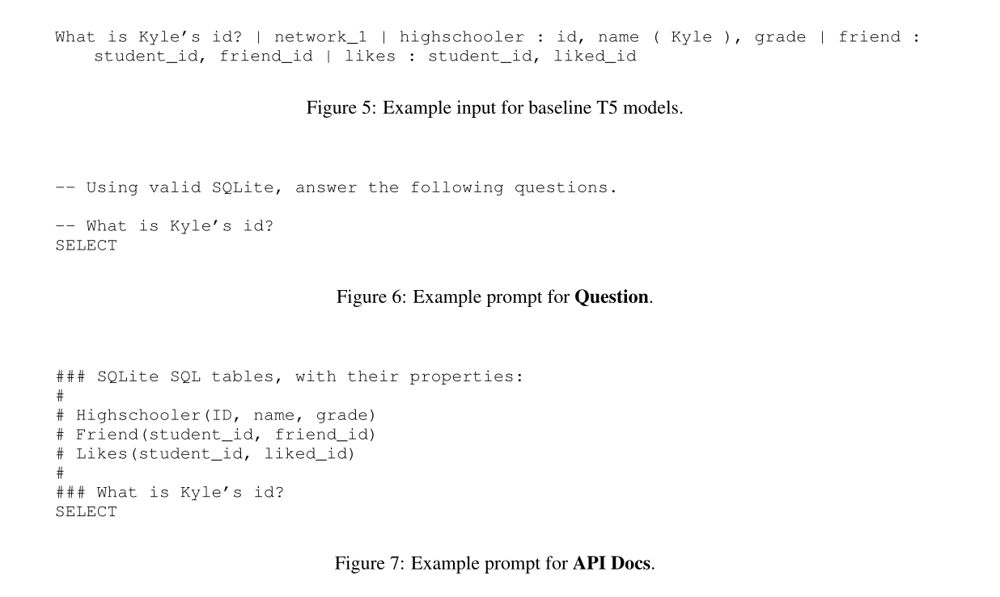
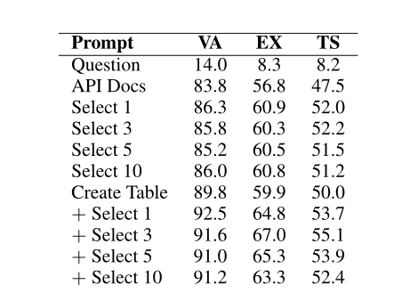

我们对Codex语言模型的文本到SQL的能力进行了实证评估。

我们发现，在没有任何微调的情况下，**Codex在Spider基准上是一个强大的baseline**；我们还分析了Codex在这种情况下的失败模式。此外，我们在GeoQuery和Scholar基准上证明，提示中提供的少量领域内的例子使Codex比在这种少量例子上进行微调的最先进的模型表现更好。

在这项工作中，我们研究了这种模型是否已经是有竞争力的文本到SQL解决方案，而不需要在特定任务的训练数据上进行任何进一步的微调，在文本到SQL的基准上评估不同规模的Codex和GPT-3模型，并有不同的提示语。

我们发现，Codex在Spider开发集上取得了高达67%的执行精度的竞争性表现。我们分析了被自动评估判断为错误的预测查询，发现其中许多查询会被人类判断为正确，而其他的查询则可能在无微调范式下被修正。最后，使用GeoQuery和Scholar基准，我们表明通过用少数例子**提示**Codex适应特定的领域，比在相同的例子上微调一个较小的语言模型**更有效**。

## 实验设计

### Zero-Shot Experiments

我们在表1中介绍了不同模型规模的结果，在表2中介绍了不同提示风格的结果。

完整的结果见附录B中的表4。

**Codex为Text-to-SQL任务提供了一个强大的基线** 在表1中，表现最好的模型（davinci-codex, Create Table + Select 3）在Spider上实现了67%的执行准确率和56.5%的测试套件执行准确率。这与BRIDGE v2（Lin等人，2020）模型的性能相当，后者在2020年12月达到了（当时）最先进的68%的执行精度。

**提示设计对性能至关重要** 从表2中可以看出，仅提供问题的结果是8.3%的低执行准确率。当API文档中引入模式信息时，执行准确率逐渐提高到56.8%；当创建表中使用有效的SQL和外键信息时，执行准确率提高到59.9%；而当创建表+选择3中引入数据库内容时，执行准确率提高到67.0%。

**更多的数据库内容会损害性能** 在表2中我们观察到，对于选择限制X的提示，在增加更多的行时，性能的变化可以忽略不计。相比之下，创建表+选择限制X提示的准确性在3行时达到顶峰，然后随着更多行的添加，性能会明显下降。

**Codex模型大小的回报递减** 虽然GPT-3的性能明显受益于模型大小的增加，但davinci-codex模型的性能并没有明显优于cushman-codex。附录B表4中的完整结果显示，在相同的提示风格下，cushman-codex通常在davinci-codex的1个百分点之内；它甚至在创建表格的提示下表现好3个百分点。这些结果表明，davinci-codex较长的上下文窗口可能是其峰值性能的主要因素，而不是增加参数数量。

#### 错误分析

我们首先考虑**语义不正确(Semantic Incorrect)**的行为，Spider评估和人类注释者都认为这是不正确的预测。

**捷径错误(Shortcut)**是指Codex使用了特定的表值或来自GPT-3预训练的 "世界知识"，而地面真实查询包含问题中的确切字词。

**GROUP BY约定错误(GROUP BY Convention)**是指Codex在非主键列（如名称或标题列）上错误地进行分组。

我们还考虑了**模糊(Ambiguous Correct)**的正确行为，这些行为在语义上与黄金查询不同，因此被Spider评估判定为不正确，但是**人类注释者认为这些行为是给定问题的可接受的SQL翻译**。**SELECT惯例(SELECT Convention)**错误是指Codex选择了与黄金查询的每个数据库惯例不同的列（例如名字而不是ID）。**SELECT Extra Columns错误**是指Codex在其查询中包括超出黄金查询所包括的额外有用列。**Argmax**错误是指Codex在如何处理最小/最大分辨率（如 "最年轻的歌手"）的平局方面与黄金查询不同。

### Few-Shot Experiments

我们调查了Codex是否可以执行Few-Shot的text2sql。正如第2节所描述的，我们将GeoQuery和Sholar数据集重新用于几率设置中。众所周知，在Spider上训练出来的模型在零次拍摄的情况下很难转移到其他单一数据库的Text-to-SQL数据集（Suhr等人，2020）。在GeoQuery和Scholar上研究Few-Shot的Text-to-SQL应该显示**模型能够在多大程度上利用少量的例子来有效地适应一个新的领域**。

基准线 基准线是一个T5-3B模型，在Spider上进行了微调，在Spider验证集上达到71%的精确匹配精度。然后，该模型在新领域--GeoQuery或Scholar上进一步微调。特定领域微调的学习率在20次设置中从[0.1, 0.2, 0.5, 1, 2] - 10-5中选择，基于300步后的最佳验证集性能。我们使用批次大小1024，这样所有的少许拍摄的例子都适合在同一个批次中。

Codex 在Create Table + Select X提示的基础上，我们在n-shot设置中向输入附加了n个问题-查询实例。图11中提供了这个提示的一个例子。注意，对于一个给定的n-shot设置，基线和Codex使用相同的支持例子集。

这些例子在Codex的提示中，并用于在新的领域上对基线进行微调。

鉴于API模型的窗口大小有限，在GeoQuery上，我们可以向davinci-codex提供多达40个支持例子，向cushman-codex和GPT-3模型提供多达10个例子。在Scholar上，查询时间更长，模式更复杂--我们在davincicodex的提示中只适合10个例子，在cushman-codex中适合5个例子，在GPT-3模型中完全不适合。

#### 结果

图2显示了在Scholar和GeoQuery数据集上的测试套件准确性。当在完整的GeoQuery训练集（549个例子）上训练时，基线达到85.7%的测试集性能。

相应的，当在整个Scholar训练集（499个例子）上训练时，它达到了87.2%的测试精度。在考虑整个数据集时，这个简单的基线是一个非常有竞争力的模型。

然而，图2显示，它在很大程度上被Codex在少数情况下击败了。在0-shot设置中，davinci-codex和cushman-codex都已经在GeoQuery上击败了基线。我们推测，Codex在这里表现良好，因为它使用了与GeoQuery数据集相同的argmax约定，这与Spider中使用的约定不同。在提示中最多有40个例子，davinci-codex在这些相同的例子上的表现远远超过了T5-3B模型的微调，而GPT-3 davinci在这个任务上的表现相当差。另一方面，T5模型在 "scholar"的Zero-Shot设置中优于Codex。在5次和10次的设置中，Codex从这些少数的样本中显示出更好的适应性，并击败了T5的基线。

### Prompts(在Zero-Shot/Few-Shot中都有)

给出一些提示，有六种提示模式，附录C中有。

第一种就是给出database schema的，第二种是为question设计了prompt的，第三种是用API Docs的模式给出了database schema的。

第四种select 3是对每个表给出三个example的，第五种create table是对每个表给出建表的sql的，第六种是第四种和第五种的结合。

## 结论

我们证明了在代码上训练的生成语言模型为Text-to-SQL提供了一个强大的baseline。我们还提供了对这些模型的失败模式的分析，我们希望这能指导在这种情况下进一步的提示设计（不管是少数的还是通过自然语言指示）。最后，我们表明，这些模型的基于提示的少量学习与较小模型的基于微调的少量学习相比，表现得很有竞争力。未来工作的一个明确方向是评估使用Codex模型进行微调的好处。

附录A中还讨论了，**Spider的开发集可以在GitHub上找到，因此可能在Codex的训练集中。然而，我们认为这并不表现为对我们结果的记忆**这个问题。