https://github.com/czyssrs/FinQA

https://finqasite.github.io/

# 论文

由金融专家撰写的关于财务报告的问题-答案对。

结果表明，流行的、大型的、预先训练好的模型在获取金融知识和对该知识进行复杂的多步骤数字推理方面远远不及人类专家。

金融QA比经典QA更具挑战性，因为它要求系统在异质来源中发现相关信息，如表格和非结构化文本，然后创建一个数字推理路径来连接所有信息。它也需要大量的知识来提出有意义的金融问题。目前还不清楚在一般领域的质量保证中表现良好的大型语言模型，在回答现实的、复杂的金融问题时能有多好。


本文介绍了FINQA，这是一个专家注解的数据集，包含8281个金融QA对，以及它们的数字推理过程。11位金融专业人士根据标准普尔500指数公司的收益报告集体构建了FINQA。


我们提出了一个检索器-生成器QA框架，首先从财务报告中检索支持性事实，然后生成可执行的推理程序来回答问题。配备预训练的语言模型，如BERT（Devlin等人，2019）和RoBERTa（Liu等人，2019），我们提出的方法优于所有其他基线，实现了65.05%的执行精度。

虽然我们的系统优于非专家人群（50.68%），但该模型与人类专家（91.16%）之间的巨大准确性差距促使我们需要进行未来的研究。


这项工作的主要贡献有三个方面。

- 我们提出了对金融数据进行质量保证的任务，以协助金融分析。该任务强调了NLP界的一个重要现象，即研究和分析当前预训练的模型在复杂和专业领域的表现。

- 我们构建了一个新的大规模数据集FINQA，其中有8281个由金融专家撰写的例子，并有完整的数字推理程序注释。

- 我们在各种基线上进行实验，发现这些模型仍然远远落后于专家的表现，有力地推动了未来的研究。


同时评估execution accuracy和program accuracy。执行精度往往会高估性能，因为有时模型只是偶然击中了正确的答案；而程序精度往往会产生错误的否定，因为有些问题可能有多个正确的程序。


本文介绍了FINQA，这是一个新的专家注释的QA数据集，旨在解决现实世界金融数据的数字推理。FINQA中的问题对现有模型解决特定领域的知识，以及获得复杂的数字推理能力提出了巨大的挑战。我们提出了基线框架并进行了全面的实验和分析。结果表明，目前的大型预训练模型仍然远远落后于人类专家的表现。

这鼓励了未来为这种现实的、复杂的应用领域开发预训练任务的潜在工作。我们相信FINQA应该成为研究界的一个宝贵资源。


## 数据处理过程

**数据准备**：现实的收益报告包含许多不适合数字推理任务的表格。利用FinTabNet中的表格注释，我们对数据进行如下过滤。首先，我们提取收益报告中最多有一个表格的页面。其次，我们排除了有超过20行、超过2个描述标题或有其他复杂嵌套结构的表格。我们还排除了具有繁琐内容的表格，例如目录，这在FinTabNet中很常见。正如第3节所述，这些过于复杂的表不在这项工作的范围之内。最后，对于有两个描述头的表，我们把它们合并成一个头，以简化表示。结果，总共有12,719个页面被选作进一步的注释。

**标注数据人员的质量**：我们在UpWork3上发布招聘广告，雇用11名具有专业金融背景（注册会计师、MBA等）的美国专家。每个雇用者都要使用四个报告范例页进行面试，并被要求编写问答范例对。聘用后，每个注释者首先经过培训，学习任务和注释界面（附录D）。当工作者完全掌握了注释过程后，我们就启动正式的批次，让他们进行工作。

**注释任务设计**：对于在第4.1节中选择的每一页，注释者被要求（i）写一个有意义的金融问题，（ii）编写一个推理程序来回答这个问题，以及（iii）注释支持的事实。每一页都被分配给一个或两个专家进行注释。

我们对每个部分详细说明如下。(I) 财务问题。对于某一页的收益报告，首先要求注释者编写一个 "对财务分析或学习公司财务报告的见解有意义 "的问题，并且需要通过数字计算来回答。我们鼓励专家写一些需要从文本和表格中获取信息来回答的问题。(II) 推理程序。在提供问题后，注释者就被要求阐述回答问题的操作步骤。具体来说，他们最多编排5个操作步骤，其中每个操作有四个slot。"操作"、"参数1"、"参数2"、"结果"。操作 "是§3中描述的十个预定义操作之一。一个 "参数 "是一个数字或一个表的行名，可以来自报告或前一步的结果。对于只使用一个参数的操作，比如表的聚合，工作者可以把参数2留空。注释界面（见附录D）会自动验证输入以确保正确性。(三）支持性事实：我们还要求注释者标记文本中的所有句子和包含回答问题所需信息的表格行。

**数据质量评估**：外部专家对FINQA问题的回答具有较高的准确性和注释者之间的一致性。为了验证注释的质量，以及建立人类专家的性能上限，我们在UpWork上雇佣了另外两名金融专业人士。我们从数据集中随机抽出200个例子，要求专业人员回答问题并写出操作步骤，过程与构建数据集的过程相同。每个问题的报酬是2.0美元。对于执行准确性，他们分别达到92.25%和90.06%（平均=91.16%）。对于程序准确性，他们分别达到89.44%和85.53%（平均=87.49%）。两位注释者之间的共识是：执行准确性为92.65%，程序准确性为86.76%。

**数据分析**：在FINQA中，23.42%的问题只需要文本中的信息来回答；62.43%的问题只需要表格中的信息来回答；14.15%的问题需要文本和表格都来回答。同时，46.30%的例子有一句话或一个表格行作为事实；42.63%有两件事实；11.07%有两件以上的事实。对于有多件事实的例子，我们还计算了所有同一例子的事实之间的最大距离。55.48%的最大距离为3句或更少5；24.35%的最大距离为4-6句；20.17%的最大距离超过6句。

在程序中，最频繁的操作，加、减、乘、除，其分布分别为14.98%、28.20%、5.82%和45.29%。除法运算的频率最高，因为计算比率在财务分析中很常见。在FINQA中，59.10%的程序有1个步骤，32.71%有2个步骤，其余8.19%有3个或更多步骤。


## 实验结果

**错误分析**：

我们从FinQANet（RoBERTa-large）模型的结果中抽出50个错误案例，并对其进行人工分析。15%的错误是由检索器引起的，例如，遗漏的事实。剩下的一半是由于缺乏金融知识，如一些术语的含义。而剩下的一半主要是数字推理错误，包括多步骤的复杂程序，数字单位转换，或解决数字和年份的排序和匹配问题。许多错误案例同时涉及数字推理问题和对金融知识的误解。我们在图4中展示了三个有代表性的错误案例。

在这些例子中，检索器的结果都正确地覆盖了黄金事实；因此我们只提出黄金事实、黄金程序和预测的程序来研究程序生成器的错误。我们在附录C中给出了更多的错误案例，包括检索器的错误案例。例1：计算 "已提取的信用额度 "的金融知识。例2：4个步骤的复杂推理。例3："亿 "和 "万 "之间的数字单位转换。


# 数据集

数据的一个例子

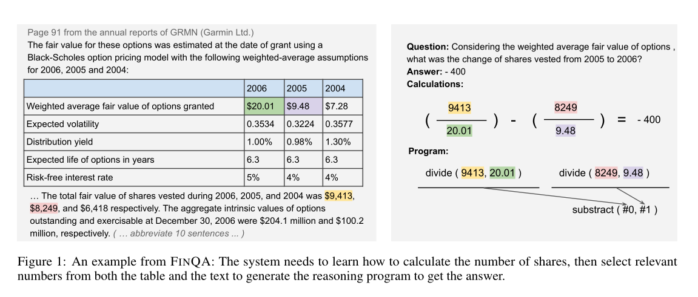


数据的形式

```python
"pre_text": the texts before the table;
"post_text": the text after the table;
"table": the table;
"id": unique example id. composed by the original report name plus example index for this report. 

"qa": {
  "question": the question;
  "program": the reasoning program;
  "gold_inds": the gold supporting facts; #right fact
  "exe_ans": the gold execution result; #right result
  "program_re": the reasoning program in nested format;
}
```


所有合法的操作

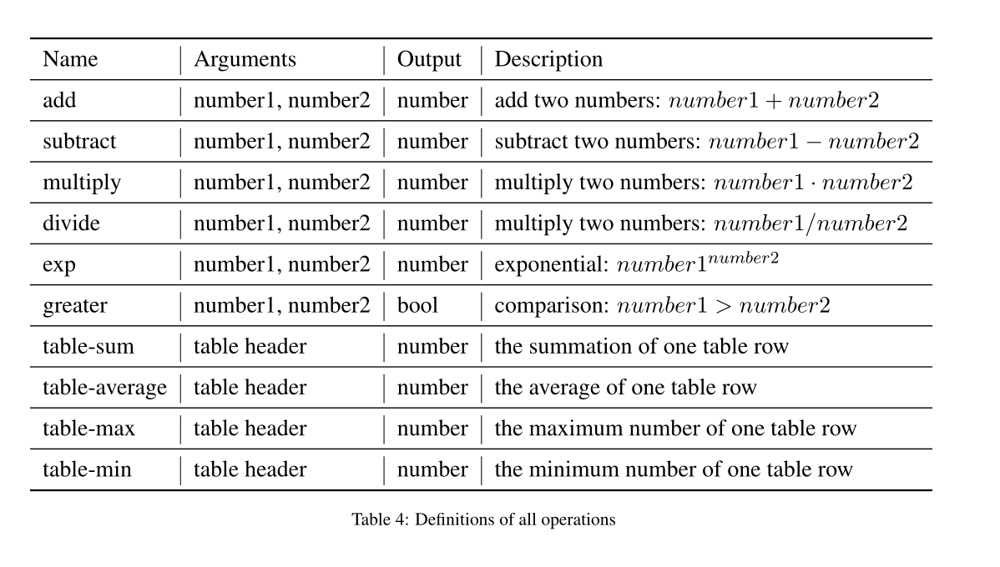

## 需要domain knowledge的例子

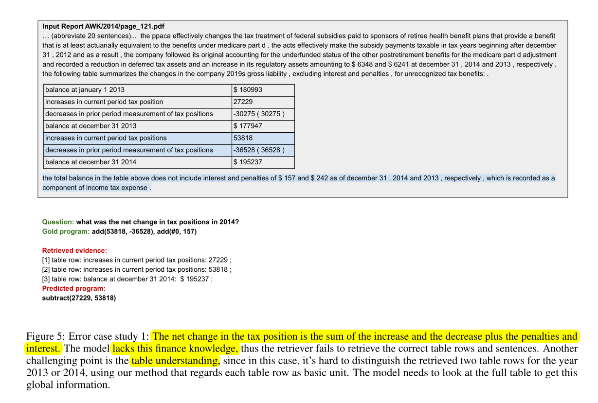

税务状况的净变化（net change）是增加和减少加上罚金和利息的总和。

net这个词在dev.json里出现的比例是130/883

net change出现的比例是 84/833


domain knowledge:

a **net** amount of money is the amount that remains when nothing more is to be taken away


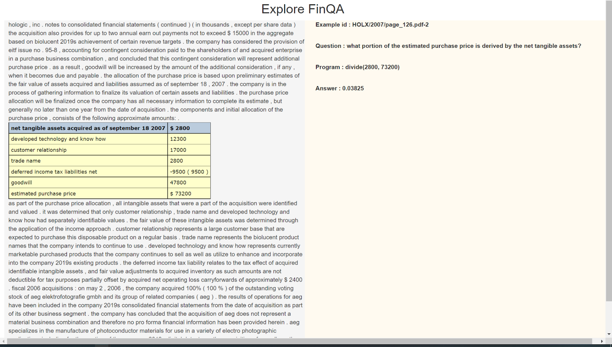


Eg. net tangible assets 有形资产净额 111 occurences

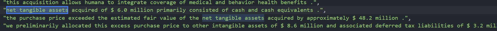


Eg. off-balance sheet 资产负债表外项目 313 ocurrences

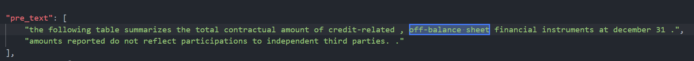


Eg. brokerage 经纪人佣金 452 occurrences

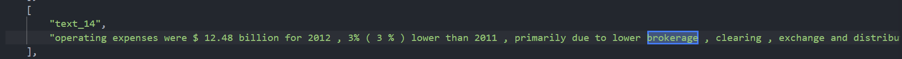


7.27更新（下面出现次数统计的是问题中出现的次数，以方便统计比例）

可以用`"explanation": ".+",`这条正则表达式来匹配explanation中有内容的数据，然后依次来判断是不是domain knowledge

可以用`"question": "(.*?)growth(.*?)",`这样的正则来匹配question中出现指定词组的次数

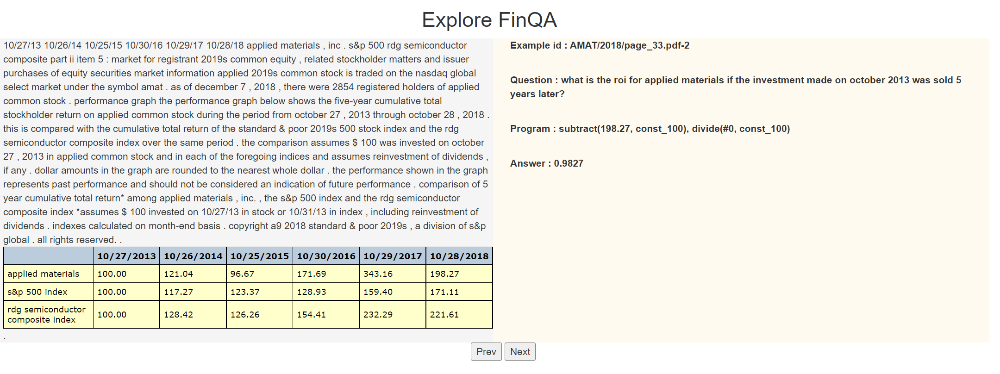

roi 投资回报率 return on investment      38/6251

投资回报率是利润除以成本。


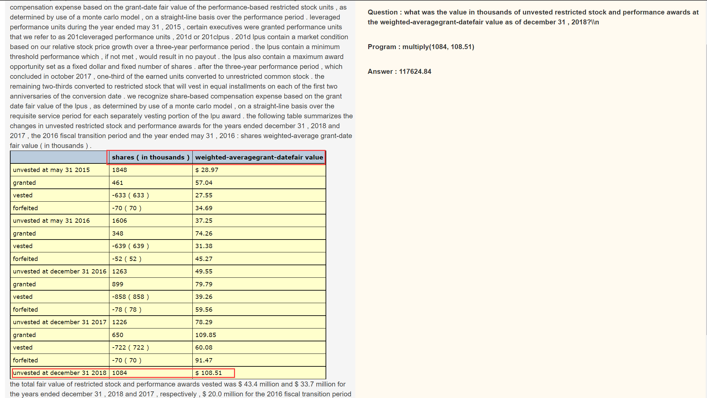

weighted-average 大量出现 问题中就出现105次

计算总数要用加权平均乘上数量。

或者解释average：

calculated by adding several amounts together, finding a total, and dividing the total by the number of amounts；

the average is the the sum of the amounts divided by the number of periods；


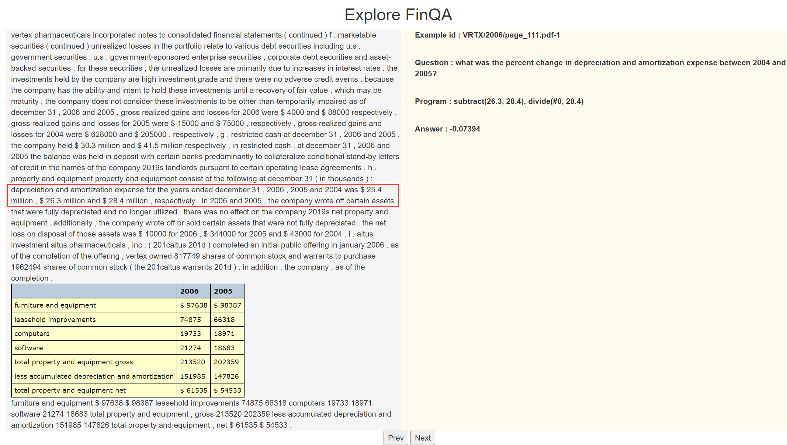

percentage change 大量出现 问题中出现 575/6251次

the percentage change is the difference from year to year divide by the earlier year balance


数据：BLK/2016/page_75.pdf

```
"question": "what is the net income in 2016?",
"answer": "3280",
"explanation": "operating income - income tax expense = net income",
"program": "subtract(4570, 1290)",
"gold_inds": {
                "table_1": "( in millions ) the operating income ( 1 ) of gaap 2016 is $ 4570 ; the operating income ( 1 ) of gaap 2015 is $ 4664 ; the operating income ( 1 ) of gaap 2014 is $ 4474 ; the operating income ( 1 ) of gaap 2016 is $ 4674 ; the operating income ( 1 ) of gaap 2015 is $ 4695 ; the operating income ( 1 ) of 2014 is $ 4563 ;",
                "table_4": "( in millions ) the income tax expense of gaap 2016 is $ 1290 ; the income tax expense of gaap 2015 is $ 1250 ; the income tax expense of gaap 2014 is $ 1131 ; the income tax expense of gaap 2016 is $ 1352 ; the income tax expense of gaap 2015 is $ 1312 ; the income tax expense of 2014 is $ 1197 ;",
                "text_7": "income tax expense ."
            },
```

net income: after tax have been paid     69/6251


数据：JPM/2009/page_132.pdf

```
"question": "what is the fluctuation of the credit spread in 2008 and 2009 , in basis points?",
"answer": "5.4",
"explanation": "its the percentual difference multiplied by the 100 basis points .",
"program": "divide(39, 37), subtract(#0, const_1), multiply(#1, const_100)",
"gold_inds": {
                "table_1": "( in millions ) the december 31 2009 of 1 basis point increase in jpmorgan chase credit spread is $ 39 ;",
                "table_2": "( in millions ) the december 31 2008 of 1 basis point increase in jpmorgan chase credit spread is $ 37 ;"
            },
```

basis point: 衡量债券或期票利率变动的最小计量单位，1个基点等于0．01%，即1%的百分之一。 基点经常被缩写为“BP”。

问题中出现次数少，但语料库中出现次数多，达到235次 ，bp出现73次


数据：VTR/2006/page_88.pdf

```
"question": "what was the percent of growth in maturities from 2009 to 2010",
"answer": "-40.1%",
"explanation": "the growth rate is the change from period to period divided by the original amount",
"program": "subtract(265915, 372725), divide(#0, 265915)",
"gold_inds": {
                "table_3": "2007 the 2010 of $ 130206 is 265915 ;",
                "table_2": "2007 the 2009 of $ 130206 is 372725 ;"
            },
```

growth rate: the change from period to period divided by the original amount  291/6251


数据：GPN/2018/page_74.pdf

解释tangible assets和intangible assets 分别在语料库中出现1999次和1853次 问题中出现2次和44次

```
"question": "what is the percent of assets are definitive net assets?",
"answer": "24.1%",
"explanation": "the assets that are definitive are tangible therefore goodwill and intangible assets are not considered definitive assets . therefore to figure out the percentage of definitive assets , one must added up all the assets and divide the tangible assets by the total assets .",
"program": "add(264844, 188294), add(144357, #0), divide(144357, #1)",
"gold_inds": {
        "table_2": "cash and cash equivalents the identified intangible assets of $ 7540 is 188294 ;",
        "table_6": "cash and cash equivalents the total identifiable net assets of $ 7540 is 144357 ;",
        "table_7": "cash and cash equivalents the goodwill of $ 7540 is 264844 ;",
        "text_14": "as of december 31 , 2018 , we considered these balances to be provisional because we were still in the process of determining the final purchase consideration , which is subject to adjustment pursuant to the purchase agreement , and gathering and reviewing information to support the valuations of the assets acquired and liabilities assumed .",
        "text_15": "goodwill arising from the acquisition of $ 264.8 million , included in the north america segment , was attributable to expected growth opportunities , an assembled workforce and potential synergies from combining our existing businesses ."
},
```

确定性资产是有形资产，因此商誉和无形资产不被认为是确定性资产。”因此，要计算出最终资产的百分比，就必须把所有的资产加起来，然后把有形资产除以总资产

tangible assets do not include goodwill , nontangible assets , and trademark . (从别的数据中来的 GPN/2009/page_69.pdf)


数据：CE/2005/page_56.pdf

quarter 100/6251

```
"question": "what is the anticipated cash dividend for each quarter in millions",
"answer": "6.25",
"explanation": "the quarterly dividend you divide the annual by 4",
"program": "divide(25, const_4)",
"gold_inds": {
                "text_11": "based on the number of outstanding shares of our series a common stock , the anticipated annual cash dividend is approximately $ 25 million ."
            },
```

检索的事实有给这一年的anticipated cash dividend，要得到each quarter要除以4


数据：MAA/2018/page_88.pdf

highest 41/6251

```
"question": "what is the highest dividend yield during 2016-2018?",
"answer": "3.884%",
"explanation": "it is the maximum value for the dividend yield during this period .",
```

当问到某一时期内的highest，返回某一时期内的maximum value


### Formula类

数据：MRO/2008/page_119.pdf

```
"question": "what is working capital for 2008?",
"answer": "$ 102",
"explanation": "for this question you need to know the formula for working capital which is ( working capital = current assets - current liabilities )",
"gold_inds": {
                "table_1": "( in millions ) the current assets of 2008 is $ 164 ;",
                "table_4": "( in millions ) the current liabilities of 2008 is 62 ;"
            },
```

对于这个问题，你需要知道营运资本的公式，即(营运资本=流动资产-流动负债)

出现1049次


下面的公式出现都是个位数

数据：HWM/2016/page_95.pdf-2

```
"question": "what is the original value of patents and licenses , in dollars?",
"answer": "208",
"explanation": "the original value is calculated based upon the gross carrying amount formula , in which the carrying amount is equal to the original value mines the amortization/depreciation costs .",
"program": "add(110, 98)",
"gold_inds": {
                "table_2": "december 31 2015 the patents and licenses of gross carrying amount is 110 ; the patents and licenses of accumulated amortization is -98 ( 98 ) ;",
                "text_0": "december 31 , 2015 carrying amount accumulated amortization ."
            },
```

原值是根据账面价值毛额公式计算的，账面价值等于原值减去摊销/折旧成本


数据：GRMN/2008/page_98.pdf-2; APD/2013/page_81.pdf-1

```
"question": "considering the fair value of options granted in 2008 , what is going to be its estimated future value when the expected life ends?",
"answer": "23.03",
"explanation": "it is the future value formula , in which $ 1847 is the present value , 3.75% is the interest rate and 6 years is the period .",
"program": "add(const_1, 3.75%), exp(#0, const_6), multiply(18.47, #1)",
"gold_inds": {
                "table_1": "the weighted average fair value of options granted of 2008 is $ 18.47 ; the weighted average fair value of options granted of 2007 is $ 33.81 ; the weighted average fair value of options granted of 2006 is $ 20.01 ;",
                "table_3": "the dividend yield of 2008 is 3.75% ( 3.75 % ) ; the dividend yield of 2007 is 0.76% ( 0.76 % ) ; the dividend yield of 2006 is 1.00% ( 1.00 % ) ;",
                "table_4": "the expected life of options in years of 2008 is 6.0 ; the expected life of options in years of 2007 is 6.0 ; the expected life of options in years of 2006 is 6.3 ;"
            },
```

future value formula / compound interest formula：future value = present value × exp((1 + interest rate), period)


数据：MRO/2008/page_119.pdf-1

```
"question": "what is the current ratio for 2008?",
"answer": "2.65",
"explanation": "for this question you need to know the current ratio formula which is ff08current assets / current liabilities )",
"program": "divide(164, 62)",
"gold_inds": {
                "table_1": "( in millions ) the current assets of 2008 is $ 164 ;",
                "table_4": "( in millions ) the current liabilities of 2008 is 62 ;"
            },
```

current ratio formula：current assets / current liabilities


```json
[
    {	
        "id": "",
        "domain_knowledge": ""
    },
    {
		
    }
]
```


## 有疑问的例子

**只需要匹配不需要理解的不算做domain knowledge，所以下面两个不算**

**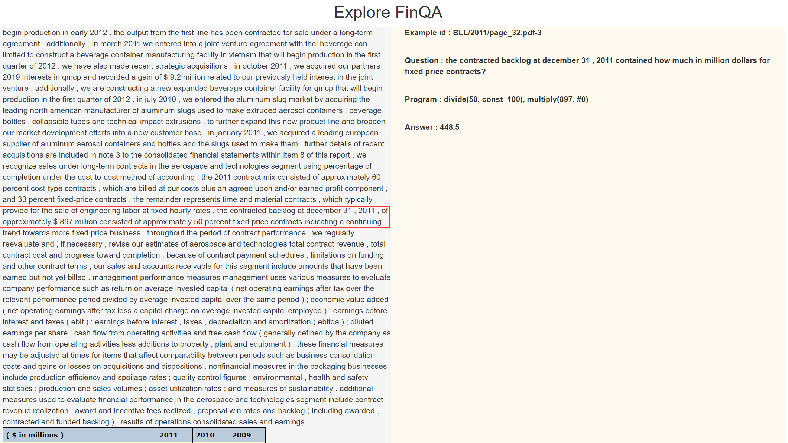**


虽然可能不懂contracted backlog和fixed price contract，但是对回答这个question没有什么影响啊。


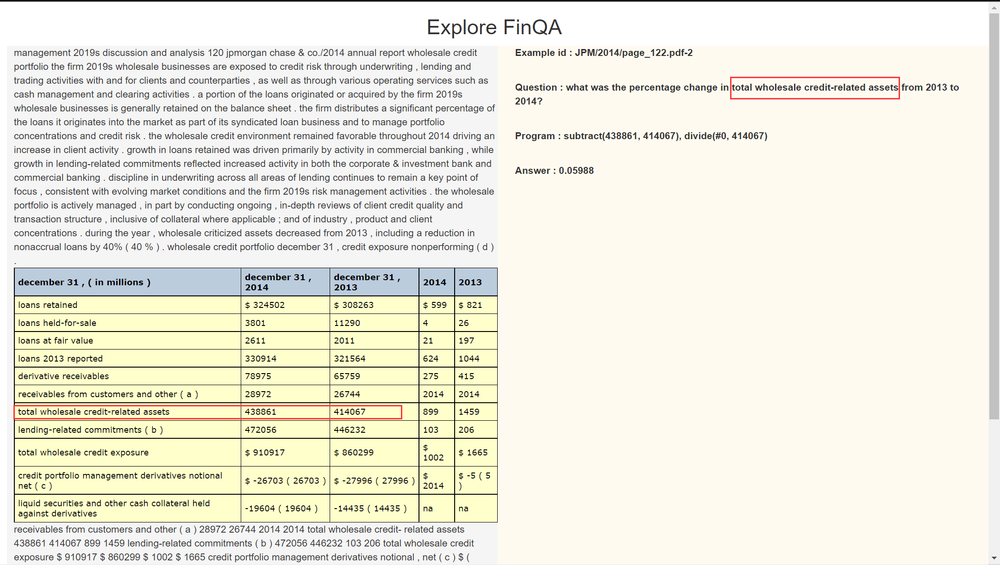


# 需要回答的问题

**这个数据集需不需要domain knowledge？**

我个人判断是需要的，因为即使是在这个dataset上单独训练出来的model也会缺乏一些金融知识，就像它paper里给出的错误例子，model理解不了net change的含义。但是因为我看todo list上说我要主要关注于jargon，所以这种convention可能先不考虑。

但是我记得之前也讨论过这个问题，就是jargon的话，我看了不懂，不代表我们的model不懂。比如net change这个词我不懂，但是不代表model没见过。所以我上面找的这些domain knowledge都是以我一个人类视角来看的。我是觉得要看model懂不懂还是直接测一下比较合理。没有model没办法判断这个jargon是否合理。

而且金融领域的jargon跟生物领域，化学领域，医学领域我个人认为还有一些差异。后者的一些术语是你一看就知道你不懂的，前者的术语感觉没有那种很生僻的词。
