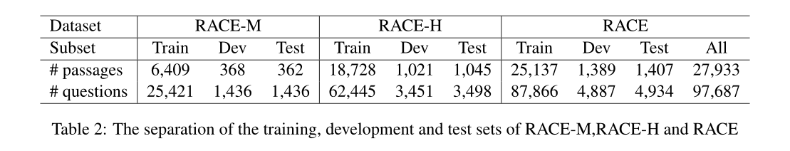
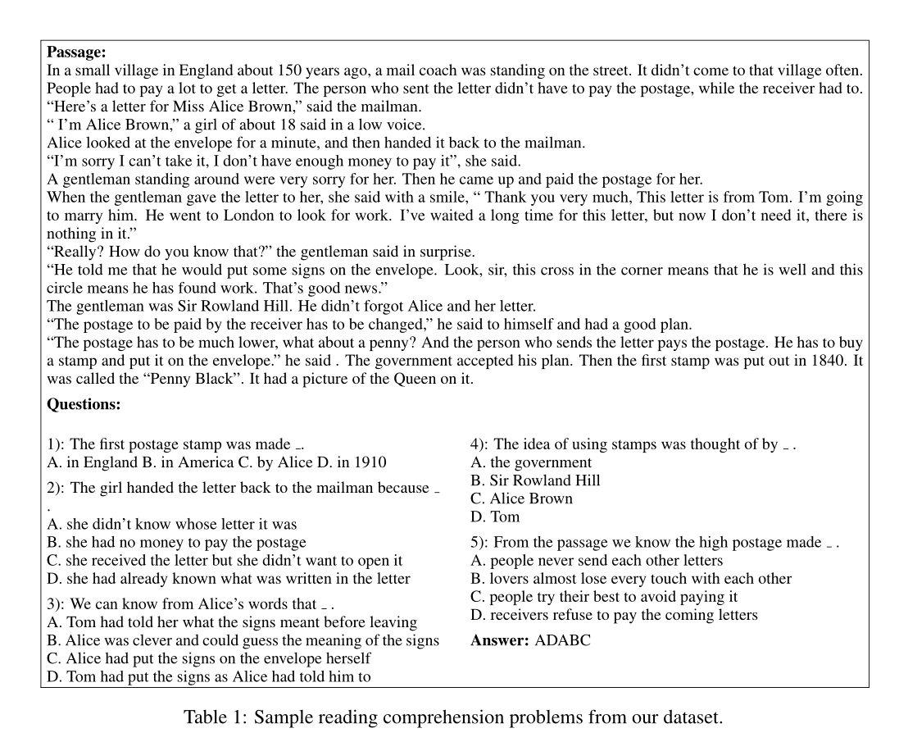

https://github.com/qizhex/RACE_AR_baselines

# 论文

我们提出了RACE，一个新的数据集，用于对**阅读理解任务**的方法进行基准评估。RACE**收集自12-18岁中国初高中学生的英语考试**，包括近28,000个段落和近100,000个由**人类专家（英语教师）生成**的问题，并涵盖了为评估学生的理解和推理能力而精心设计的各种主题。

特别是，RACE中需要推理的问题的比例比其他阅读理解的基准数据集要大得多，而且在最先进的模型的性能（43%）和人类性能的上限（95%）之间有很大差距。

我们的新数据集，即RACE，**包括27,933个段落和97,687个问题**。在阅读完每个段落后，每个学生都被要求回答几个问题，每个问题都有四个候选答案，其中只有一个是正确的。与现有的数据集不同，RACE中的问题和候选答案并不局限于原始段落中的文本跨度。

RACE的段落**几乎涵盖了所有类型的人类文章，如新闻、故事、广告、传记、哲学等，风格各异。**这种话题/文体覆盖的全面性使得RACE成为评估一般机器学习系统的阅读理解能力的理想资源。

与现有的机器阅读理解的大型数据集相比，我们提出的数据集的优势可以总结为以下几点。

- 所有的问题和候选选项都是由人类专家生成的，这些问题和选项都是有意设计的，以测试人类代理人的阅读理解能力。这使得RACE成为反映机器学习系统在人类判断下的文本理解能力的相对准确的指标。

- 就涉及推理的大部分问题而言，这些问题比现有数据集中的问题要难得多。同时，它也足够大，可以支持深度学习模型的训练。

- 与现有的大规模数据集不同，RACE中的候选选项是人类生成的句子，可能不会出现在原始段落中。这使得任务更具挑战性，并允许有丰富的问题类型，如段落总结和态度分析。

- 广泛覆盖各种领域和写作风格：这是评估学习模型的通用（而不是特定领域/风格）理解能力的理想属性。


RACE收集自为中国12-15岁的初中生和15-18岁的高中生设计的英语考试。为了区分这两个有巨大难度差距的子组，RACE-M表示初中考试，RACE-H表示高中考试。我们将RACE-M和RACE-H的5%的数据分别作为开发集和测试集。每组的样本数如表2所示。表3总结了RACE-M和RACE-H的统计数据。我们可以发现，RACE-H的段落长度和词汇量都比RACE-M大得多，这证明了高中考试的难度较高。

然而，请注意，由于这些文章和问题是为测试中国学生的英语学习而选择和设计的，所以词汇量和语言结构的复杂性比其他QA数据集的新闻文章和维基百科文章要简单。

为了全面了解RACE的推理难度要求，我们对问题类型进行了人工注释。我们将问题分为以下五类，难度从高到低。

- 字词匹配：问题与文章中的一个跨度完全匹配。答案是不言自明的。

- 转述。该问题与文章中的一个句子完全对应或转述。答案可以在这句话中提取出来。

- 单句式推理。通过识别不完整的信息或概念上的重叠，可以从文章的一句话中推断出答案。

- 多句式推理。必须通过综合分布在多个句子中的信息来推断出答案。

- 不充分/不明确：该问题没有答案，或者根据给定的段落，答案不唯一。


数据集分割情况




# 数据集

数据样例




字典里有answer，options，questions和article

```
{"answers": ["B", "C", "D", "B", "B"], "options": [["When they are poor.", "When they run out of oil.", "When they need more exercise.", "When there aren't any big trees in the world."], ["Water.", "Coal.", "Wood and plants.", "Tides."], ["2.", "5.", "4.", "3."], ["There is more petroleum than we can use now.", "Trees are needed for some other things besides making gas.", "We got electricity from ocean tides in the old days.", "Gas wasn't used to run cars in the Second World War."], ["how to run our cars", "what to do when oil runs out", "different types of gas", "the ways to make electricity"]], "questions": ["When might people have to go back to using horses and carriages?", "What did some people use to make gas in the Second World War?", "How many ways are suggested to make electricity in the passage?", "According to the passage, which of the following statements is TRUE?", "The passage is mainly about   _  ."], "article": "There is not enough oil in the world now. As time goes by, it becomes less and less, so what are we going to do when it runs out? Perhaps we will go back to using horses, carriages and bicycles.\nIn the Second World War, some people didn't use gas made from petroleum  in their cars. They made gas from wood and plants instead. The car didn't go fast, but they ran, so this was better than nothing. However, in the future, we can't cut down all our trees to make gas; we need our trees for other things, too.\nBesides different types of gas, we can also use electricity  to run our cars, but first we must make the electricity! Some countries have coal  and they make electricity with that, but we might not always have coal, either. Other countries have big, strong rivers, and they can use the power of water to turn turbines  and make electricity more easily and cheaply.\nWe are also able to get power from the ocean tides. We put turbines into the mouth of the river. Then the tide comes in, the water turns the turbines and then it goes out, it turns them again.\nWhich of these ways will be used to run our cars in the future?", "id": "middle3.txt"}
```

```
{"answers": ["C", "A", "B", "C"], "options": [["he has much money.", "he likes the shops.", "he likes to compare the prices between the same items.", "he has nothing to do but shopping."], ["their ways of shopping are quite different", "they hate each other.", "they needn't buy anything for the family", "they don't have time for it."], ["he is young", "he is absent-minded", "he often loses his money", "he doesn't like shopping"], ["the shop was closed that day", "the policeman stopped him", "he forgot some of them", "he gave all the money to the beggar"]], "questions": ["The husband likes shopping because   _  .", "They never go shopping together because  _  .", "Jimmy can't do the shopping well because   _  .", "Jimmy didn't buy what his mother wanted because  _  ."], "article": "My husband is a born shopper. He loves to look at things and to touch them. He likes to compare prices between the same items in different shops. He would never think of buying anything without looking around in several different shops. On the other hand, I'm not a shopper. I think shopping is boring and unpleasant. If I like something and I have enough money to take it, I buy it at once. I never look around for a good price or a better deal. Of course my husband and I never go shopping together. Doing shopping together would be too painful for both of us. When it comes to shopping, we go our different ways.\nSometimes I ask my son Jimmy to buy some food in the shop not far from our home. But he is always absent-minded. This was his story.\nOne day I said to him, \" I hope you won't forget what I have told you to buy.\" \" No,\" said Jimmy. \"I won't forget. You want three oranges , six eggs and a pound of meat.\"\nHe went running down the street to the shop. As he ran, he said to himself over and over again, \"three oranges , six eggs and a pound of meat.\"\nIn the beginning he remembered everything but he stopped several times. Once he saw two men fighting outside a clothes shop until a policeman stopped them. One of them was badly hurt. Then he stopped to give ten cents to a beggar. Then he met some of his friends and he played with them for a while. When he reached the shop, he had forgotten everything except six eggs.\nAs he walked home, his face became sadder and sadder. When he saw me he said, \"I'm sorry, Mum. I have forgotten to buy oranges and the meat. I only remembered to buy six eggs, but I've dropped three of them.\"", "id": "high1.txt"}
```

