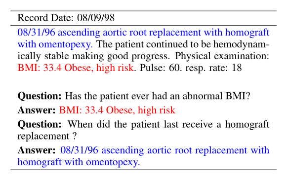

# 论文

主要贡献：

- 一个新的框架，用于系统地生成特定领域的大规模QA数据集，可用于任何人工注释难以获得但其他NLP任务可获得有限注释的领域。

- 第一个可访问的针对病人的EMR QA数据集emrQA，由40万个问题-答案对和100万个问题-逻辑形式对组成。逻辑形式将允许用户训练和测试可解释的模型，这些模型用相应的逻辑形式来证明答案。

- 两个新的推理挑战，即算术和时间推理，在SQuAD（Rajpurkar等人，2016）这样的开放域数据集中是没有的。

# 数据集

domain-specific的 从电子病历生成的

1 million questions-logical form and 400,000+ question-answer evidence pairs

即100万个问题-逻辑形式和400,000多个问题-答案证据对

一条数据的例子

