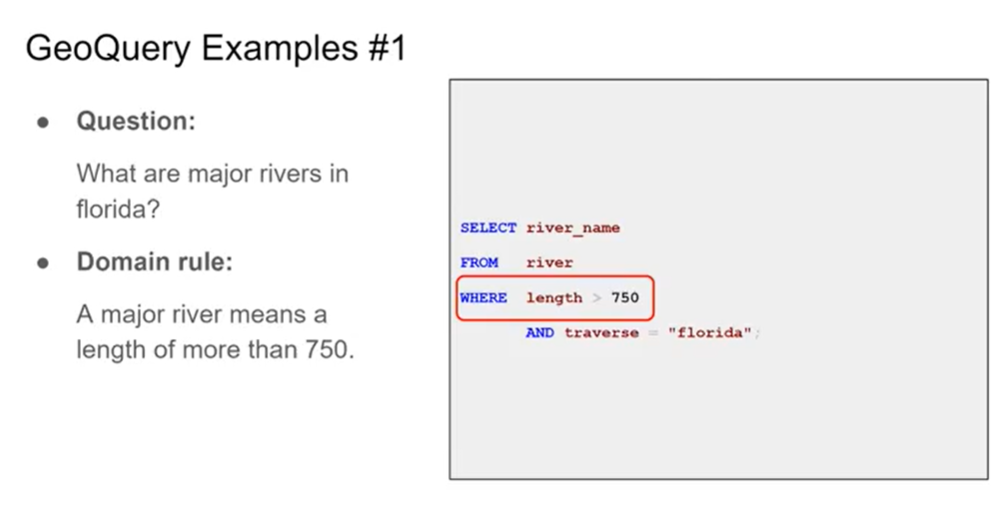

# 7.11

Spider本身是一个cross domain上训练出来的模型，但是用到domain specfic的数据集上表现都很差。

domain shift就是想做一个从task specific的model到domain specific的model的工作，并且这种迁移不是靠大量的人工标注的数据学习而来的，而是通过少量domain rules迁移过来的。

For example:

比如对于这个问题，什么叫major river。我们不希望通过大量给出长度大于750米的，被标注为major的river数据来训练模型，让它知道长度大于750米叫major。而是希望直接提供给它这个rule。

名词方面的知识，可以先看大模型（codex、gpt3）知不知道，如果不知道，可能也需要提供这部分的domain knowledge。

## 需要完成的工作[Action List]

### 读Paper

看BEIR这篇论文，提出了一个zero-shot model的benchmark

在我们项目上的类比：leverage很多不同的数据集，提出一个domain shift的benchmark

主要考虑两点：他们是如何基于18个数据集建立起来这个benchmark的，比如如何选取task，不同的domain等等，看对数据集怎么用，是囊括一部分还是全部囊括；然后我们能从他们的工作中学到什么。

除了BEIR之外还要自己去找其他的paper，找数据集的paper。（由学长负责）不用刻意找，顺便看到了可以看一眼。

### 在不同的任务上定义domain shift

要涉及哪些task？

semantic parsing肯定要涉及，其他的比如QA，NER要不要涉及，domain shift对这些任务重不重要？

主要从semantic parsing和QA入手。

#### semantic parsing(Text-to-SQL)

主要有八大数据集。这八大数据集上的domain rules已经标出来了，我们可以看一看体会一下。可以看一看能不能改进或者有没有别的想法。

除此之外，还要引入3-4个新的数据集。对数据集不仅要看paper，还要聚焦于：

- domain knowledge是不是必要的**（最关键的）**
  - 看看对于人来说，一个问题是不是需要额外的知识去回答
  - 上面是一个粗略的估计，因为有些专有名词，大模型可能知道（暂时先不管）
  - 不会是很专业的东西，是一个dateset specific的东西。

- domain knowledge是否适用 即这个数据集能否用比较少的rules概括绝大部分数据所需的domain knowledge

看大概一两百个数据之后，保存具有特点的数据，就是很明显是需要domain knowledge去解答的，然后有共同的domain knowledge的。

#### QA

跟上面的逻辑差不多。

### 定义好了之后证明我们的工作是有意义的

# 7.14

思考domain knowledge的范围

继续做数据集的调研
