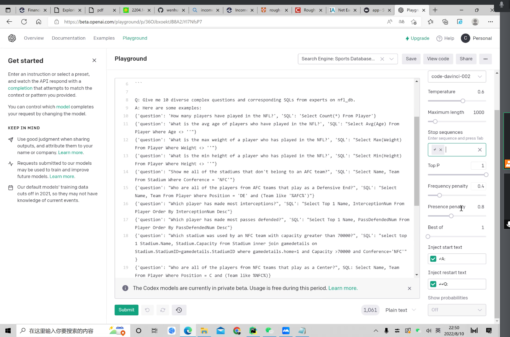

# 7.11

Spider本身是一个cross domain上训练出来的模型，但是用到domain specfic的数据集上表现都很差。

domain shift就是想做一个从task specific的model到domain specific的model的工作，并且这种迁移不是靠大量的人工标注的数据学习而来的，而是通过少量domain rules迁移过来的。

For example:

比如对于这个问题，什么叫major river。我们不希望通过大量给出长度大于750米的，被标注为major的river数据来训练模型，让它知道长度大于750米叫major。而是希望直接提供给它这个rule。

名词方面的知识，可以先看大模型（codex、gpt3）知不知道，如果不知道，可能也需要提供这部分的domain knowledge。

## 需要完成的工作[Action List]

### 读Paper

看BEIR这篇论文，提出了一个zero-shot model的benchmark

在我们项目上的类比：leverage很多不同的数据集，提出一个domain shift的benchmark

主要考虑两点：他们是如何基于18个数据集建立起来这个benchmark的，比如如何选取task，不同的domain等等，看对数据集怎么用，是囊括一部分还是全部囊括；然后我们能从他们的工作中学到什么。

除了BEIR之外还要自己去找其他的paper，找数据集的paper。（由学长负责）不用刻意找，顺便看到了可以看一眼。

### 在不同的任务上定义domain shift

要涉及哪些task？

semantic parsing肯定要涉及，其他的比如QA，NER要不要涉及，domain shift对这些任务重不重要？

主要从semantic parsing和QA入手。

#### semantic parsing(Text-to-SQL)

主要有八大数据集。这八大数据集上的domain rules已经标出来了，我们可以看一看体会一下。可以看一看能不能改进或者有没有别的想法。

除此之外，还要引入3-4个新的数据集。对数据集不仅要看paper，还要聚焦于：

- domain knowledge是不是必要的**（最关键的）**
  - 看看对于人来说，一个问题是不是需要额外的知识去回答
  - 上面是一个粗略的估计，因为有些专有名词，大模型可能知道（暂时先不管）
  - 不会是很专业的东西，是一个dateset specific的东西。

- domain knowledge是否适用 即这个数据集能否用比较少的rules概括绝大部分数据所需的domain knowledge

看大概一两百个数据之后，保存具有特点的数据，就是很明显是需要domain knowledge去解答的，然后有共同的domain knowledge的。

#### QA

跟上面的逻辑差不多。

### 定义好了之后证明我们的工作是有意义的

# 7.14

思考domain knowledge的范围

继续做数据集的调研

后续补充：

- 如果自己的任务过完了的话，把google slides更新好了之后可以在那个google sheet上自己认领一个新的，在群里说一声就行
- 如果数据集看完了的话可以去那个google slides里面把自己对应看的数据集的结论放在最后，并且如果可以的话也放几个典型例子哈
  google slides的链接我已经给你们share过去啦

# 7.20

把自己做的东西放到ppt上

# 8.1

之后都是单人开会，这样效率会更高一些。（信号：需要更motivate一些）

现在的task setting是[Domain Context] + [Input] + [Interactive Feedback]，做一个interactive的robot，然后先给它domain context（包含一些database的列的解释这种），然后给question，对于question去domain context里搜集回答这个question需要的信息作为domain knowledge，然后通过interactive的feedback来收集domain knowledge。

# 8.7

余老师的想法是：domain knowledge不需要分条列，作为一整个domain context给它。

之后学长会去继续找老师讨论task setting的问题。

后面先集中于FinQA，先标数据，然后也想一想什么东西能够囊括大部分的FinQA里的domain knowledge。标的数据要放到一个文件里面。

# 8.10

继续标FinQA，争取能标到80条左右，然后之后会用Codex去测试一下。

用codex记得换model，换成codex。

# 8.13

针对我自己标的domain knowledge，在test和dev这两个数据集上，每条数据标上5-8条。

利用codex可以询问得到一些公式，利用investopedia可以进行搜索。

# 8.14

标test的 669 - 969

# 8.17

分析codex跑出来的结果，看看有没有什么有趣的发现。

involve更多的task，看一下不同领域summarization，比如对一篇新闻给出一个summarization，有比较多的convention，比如summarization的长度，用词的偏好，是严肃的还是诙谐的。

找一下不同领域的summarization的task，找一下dataset和benchmark。看一下这个能不能fit到我们的task中。

读一篇paperhttp://arxiv.org/abs/1809.01494，看看能不能在domain shift project里面用这个dataset。

# 8.21

主要focus在summarization的survey上这一块，summarization这一块也是cross domain到specific domain的一个过程，主要也是看jargons或者convention。

# 8.26

集中在convention这一块，可以开始大规模的标注数据。

主要交给我跟liwei，之后我们可以自己讨论，就是convention这一块。

annotate流程：

- 生成所有prediction，跟golden_sql进行对比
- 然后得出domain knowledge，转为natural language形式

engine要用code-davinci-002！

benchmark是在选dataset

summarization这一块，主要问题在于很难评测。

