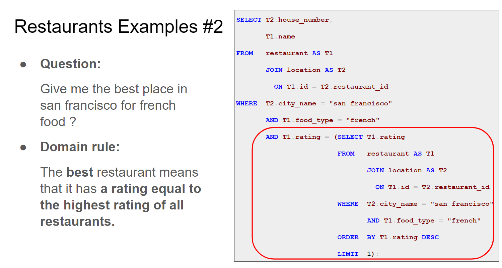
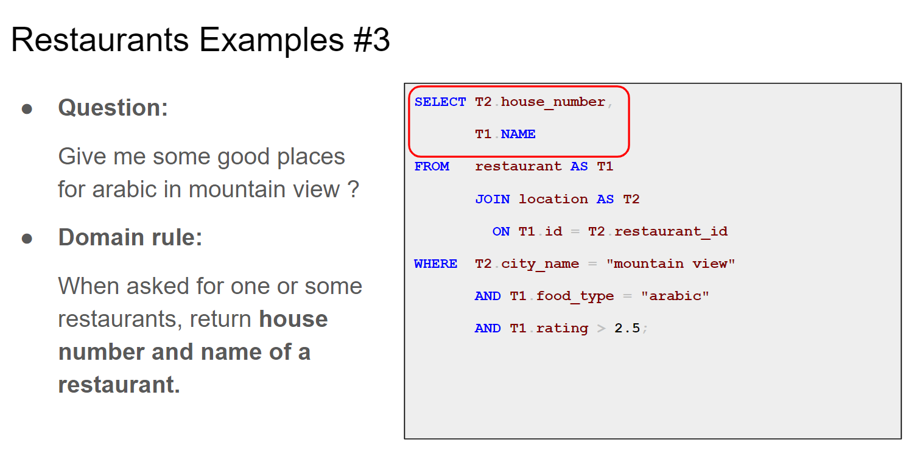
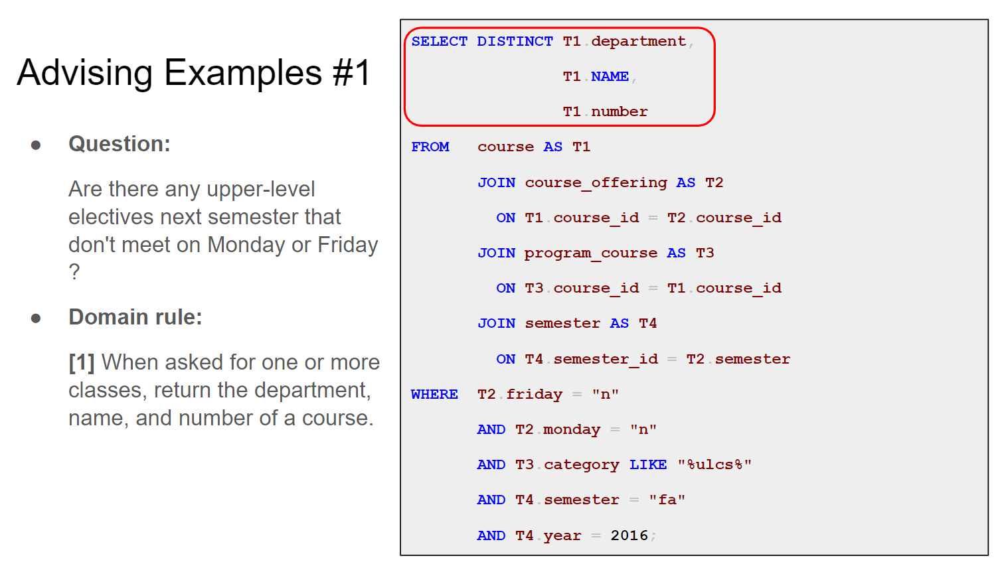

# 7.11

**semantic parsing是什么？**

语义解析，就是Text-to-SQL。

**去看看codex和gpt3这两个大模型。**

**spider是什么？**

（8.6 更新）已经看完spider论文，一个benchmark，提出了一个新的任务。

## 到底什么样的问题要domain knowledge？

这个为什么是要domain knowledge？

理解了，就是best的意思是某个属性是最高的，这里的domain rule是在说明rating得是最高的。

这个要domain knowledge是因为当问到give some good places时，需要知道什么叫给出一个place，就是要给出房子名字和餐厅名字。

这个是因为当问到有哪些课程时，domain knowledge定义要返回的课程的哪些信息。

所以每个问到说有什么课程，什么位置，什么人，都需要domain knowledge去定义返回这个实体的哪些属性。

而且domain knowledge对应的部分主要是select什么和where什么，就是要查询哪些属性以及对这些属性的规范条件。那from后面为什么没有对应任何domain knowledge呢？

# 7.20

**NLI，机器翻译这样的任务也要囊括进来吗？为什么可以囊括进来呢？**

初步理解：应该只要是从text生成某种数据的都可以，比如semantic parsing是text2sql，QA是text到text，因为只要是生成，我们就可以判断是否需要添加domain knowledge。所以机器翻译这样的也可以。

（更新）很多QA是不行的，余老师的要求是最好能分离出domain knowledge，text2sql这样的任务可以清晰地看到推理过程（sql语句的构成），我们可以通过看sql语句哪个部分有问题，明确地知道它需要哪些domain knowledge。而QA并不能，很多时候问题答案就是一个yes，no，总而言之是看不到推理过程的answer。但有的QA可能是可以的，比如FinQA，因为它给出答案是有一个明确的推理过程的。

**看数据集的目的是什么？**

**dataset specific和domain specific？**

之前说我们的目标是对一个general的model，给它某个domain的domain knowledge之后它能够在那个domain上性能提升，当然跟在那个domain上专门训练的model肯定性能还是有差距。那真实的应用场景到底是什么，就是我们是希望说，这个general model在应用中，对于不同的domain，只要我给它domain knowledge，它就能比较好的应用的这个domain中吗？如果是这样的话那这个domain knowledge是怎么来的，是人工标注的吗，如果是人工标注的话那它肯定是针对某个dataset标注的吧。还是说这个domain knowledge就是我们总结的不同domain的knowledge，就是不是针对某个数据集标的。

（7.27更新）task setting的问题，上次讨论过了，还是一个需要讨论的真实应用场景的问题。

**到底怎么判断QA数据集要不要domain knowledge啊？**

我有点理解不了怎么看这个FinQA要不要domain knowledge啊。就是我感觉它跟reading comprehension没什么区别啊，对一个question它得到的答案都是基于给它的文本的，我感觉这种应该都不需要domain knowledge吧。因为domain knowledge无论是jargon还是convention得是model不知道的一些东西。但是FinQA的话，它要解决的这个question是完全依赖于文本的，所以就是如果看过了文本它就没什么不知道的东西了。所以我感觉不需要domain knowledge啊。

（7.21更新）不对，可能有一些**术语**是不懂得，也就是jargon。但我感觉这种都是用模型测一下比较明显，感觉我去一个一个看很花时间。因为我第一时间也很难反应过来某些jargon模型是不是可能不懂，得是那些我看过去不太懂，并且文章里也没有出现这个词的需要，这样筛选挺麻烦的。

（7.24修正）不对好像，我想了一想，我们到时候是把在general的语料库上训练的model应用到这个domain上，是一个zero shot，相当于这个FinQA的语料直接就是测试用，那么那些jargon就不是说，model看了文本，就知道了，就会做question了，不是这样。

# 7.27

**FinQA这个数据集到底要怎么分离出domain knowledge?**

关注金融知识，比如某些概念要怎么算这样，像刚刚看到的一个投资回报率这种。判断依据就是我自己如果不太懂的话，就判断为model可能也不知道。因为一些金融学方面的词组，model是不懂要把它们放在一起看的。

就是我用这样的方式来搜集domain knowledge，我看到一个问题，然后去看回答这个问题需要的一些事实（从文本和表格中找），如果有一些我理解不了的概念，就判断为domain knowledge。

# 8.21

**怎么看这个数据集能不能用到我们的proj里来？**

因为之前像text2sql那一块，我们是cross domain到specific domain，验证的是大模型迁移到特定领域的能力。那这个dataset我们是想要验证什么呢？
